# School Business Planning
## Introduction 

For UK further education providers, student enrolment figures for each academic year are a core business priority, as they significantly influence the level of funding received (Bolton and Lewis, 2023). As a result, effective business planning is a key activity for schools to ensure the appropriate allocation of students to sector subject areas in future academic years. This process can be informed by factors such as industry trends, anticipated growth/decline, and historical performance. With this in mind, this project was initiated to facilitate the student business planning process of a specific further education college. 

The project’s output was the creation of a web application designed for student business planning. To manage this, an Agile approach was employed, allowing the project’s elements to be divided into iterative cycles (Layton and Ostermiller, 2017). This methodology also provided the flexibility to facilitate changes to requirements and outputs as the project progressed. The Scrum framework was implemented to supplement this approach, allowing each project cycle to be structured as a sprint (Pries and Quigley, 2010). Each sprint was planned based on the prioritisation of backlog items, executed accordingly, and subsequently reviewed by the project’s Scrum team members. 

*Figure 1, Overview of scrum project (Pries and Quigley, 2010)*

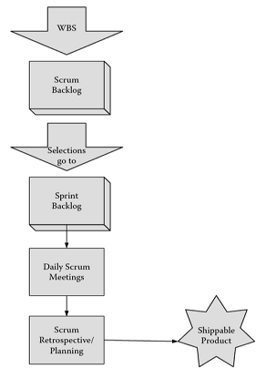

In order to manage the backlog, sprints, and artefacts produced of the project, GitHub was utilised. A GitHub project was created for the backlog in which each project task was added as a GitHub issue and tracked using a kanban board. 

*Figure 2, Kanban board of School Business Planning GitHub project*

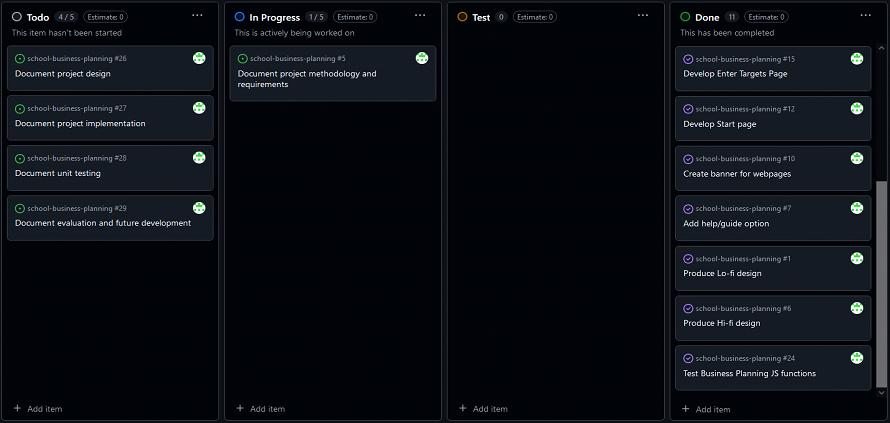

Issues involving the creation or amendment of project artefacts were linked with respective branches. Pull requests were then generated for these branches and finally, once ready, merged back into the main branch of the project. This process ensured adherence to the Continuous Integration/Continuous Deployment (CI/CD) workflow.

*Figure 3, GitHub branches of School Business Planning Project*

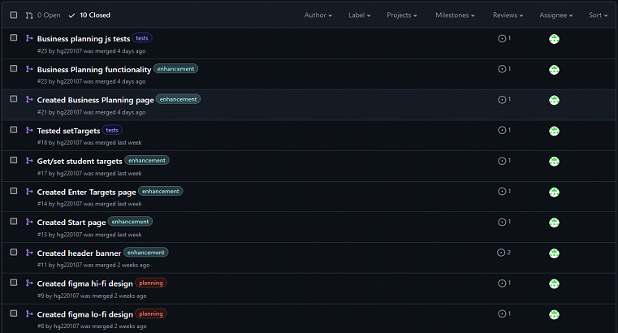

A repository was created to store the project artefacts and deploy the School Business Planning Application via GitHub Pages. 

*Figure 4, GitHub repository for School Business Planning Project*

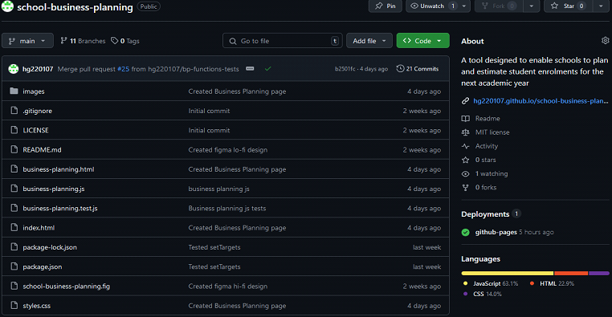

## Application Design 

### Requirements Scoping 

The previous process for student business planning involved creating individual spreadsheets for each curriculum area, consolidating them, and calculating the expected student numbers against target allocations. To improve upon this process and gather the necessary requirements for developing the application, meetings were held with key stakeholder groups, including Curriculum Heads, Management Information Systems, Executive Management, Finance, and others. 

A design thinking approach (Razzouk and Shute, 2012) was employed during these discussions to clearly define the business problem and empathise with stakeholders’ needs and challenges in the business planning process. Through brainstorming and ideation sessions, several common themes emerged among the project stakeholders: 

* The business planning platform should be intuitive and simple enough for most staff to use with minimal difficulty. 
* Using multiple spreadsheets for business planning is inconvenient, error-prone, and requires consolidation. A single platform would be more efficient and user-friendly. 
* In addition to adding courses with expected student numbers, the platform must also allow for amendments and deletions to accommodate for changes to business requirements. 
* The application should support business planning separately for under-18 students and adults, as these provisions have separate budgets and allocations. 
* The platform should be optimised for business planning on desktop computers but should at least be accessible on other devices as well. 

These requirements were incorporated into the subsequent design, development, and testing phases of the project. 

### Prototyping 

Prototypes were developed using Figma to visualise the interface and general flow of the business planning web application: https://www.figma.com/design/uv1H9ubSMs4cHq7KOIjh4M/school-business-planning?node-id=0-1&m=dev&t=FA55nz2FoaiQYEeb-1. Firstly, a low-fidelity wireframe version was created. 

*Figure 5, low-fidelity design of Business Planning application*

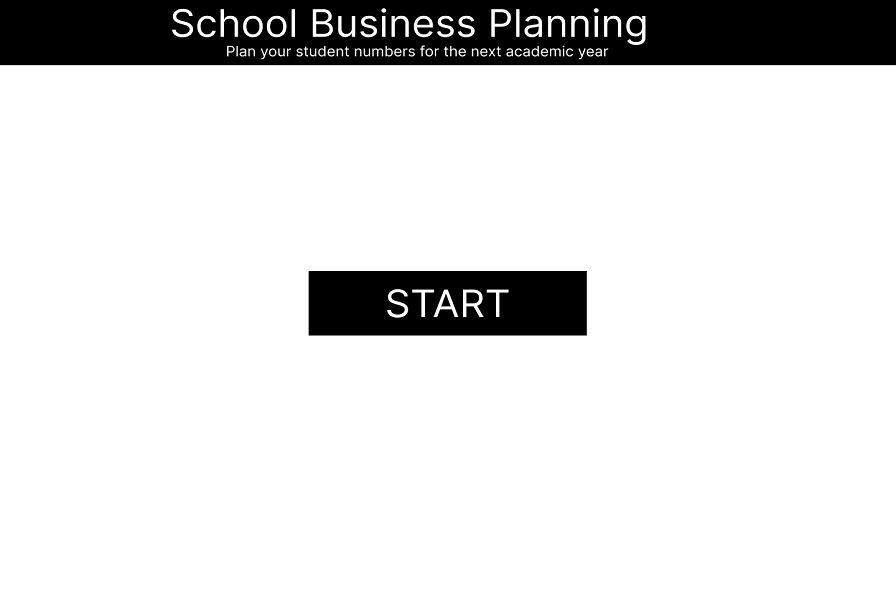

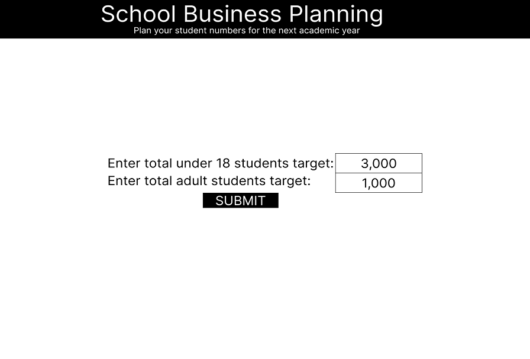

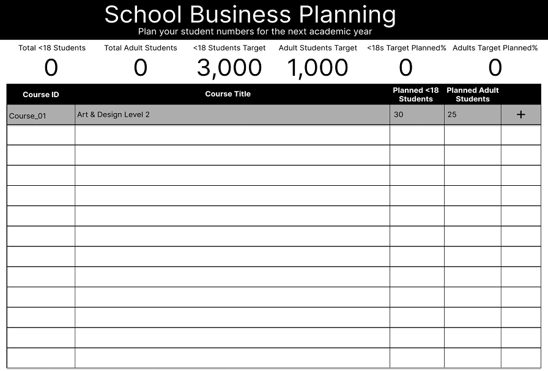

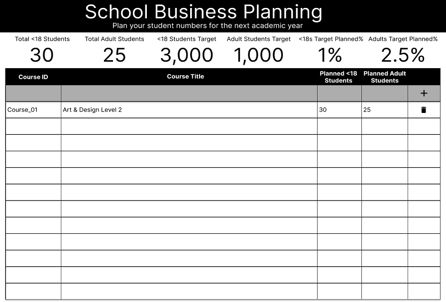 

In this design, the user begins on the ‘Start’ page, where they can simply click the ‘START’ button to proceed. This navigates the user to the ‘Enter Targets’ page, where they must input the target allocations for under-18 and adult learners, then confirm these by clicking the ‘SUBMIT’ button.  

After submitting the targets, the user is directed to the ‘Business Planning’ page. This page features header cards displaying the total number of students, target allocations, and the percentage of students planned against the targets. A table is also present, allowing the user to add courses and the anticipated number of under-18 and adult learners for each, via the top row. Once added using the plus icon, the user may also remove courses from the business planning table using the trash icon. 

A high-fidelity version of the application was also created.  

*Figure 6, High-fidelity design of Business Planning application*

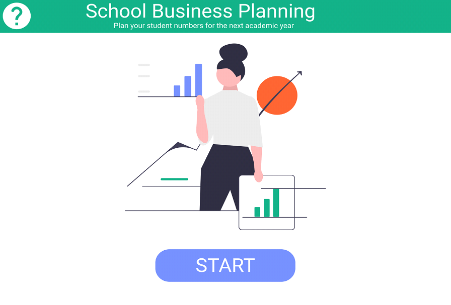

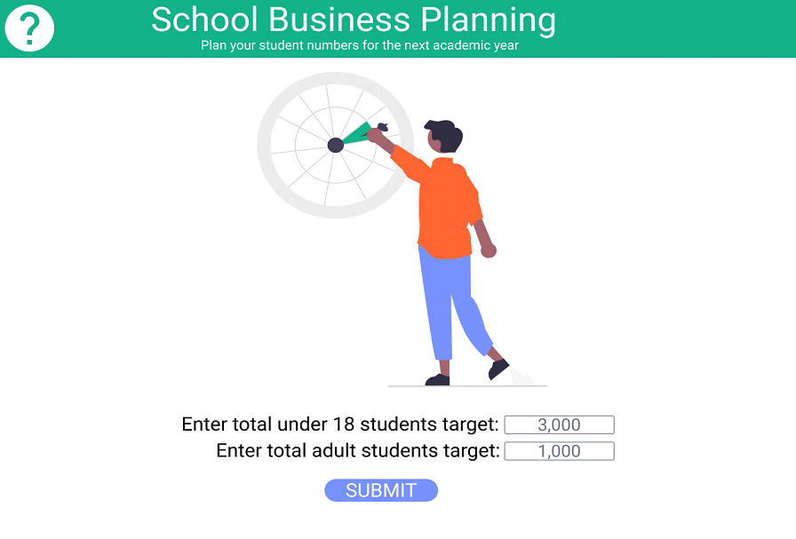

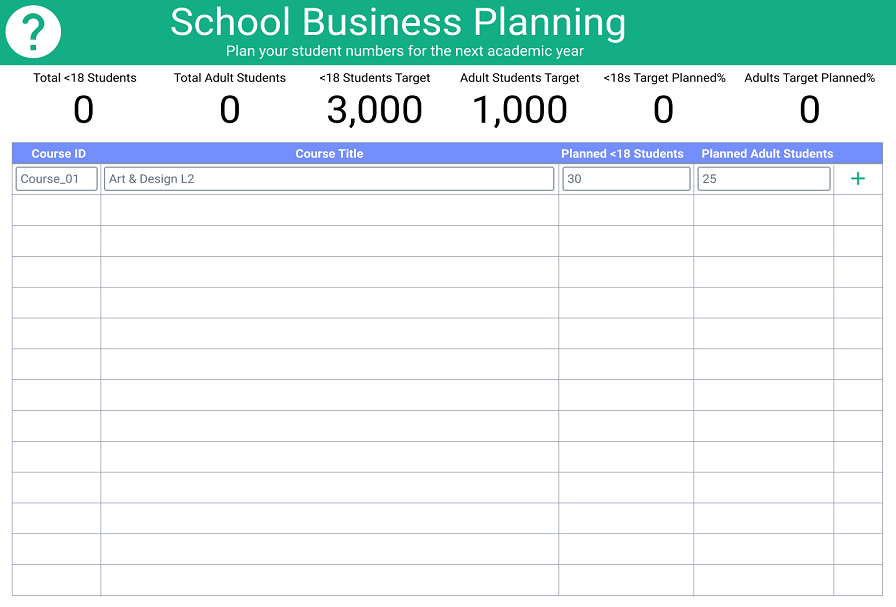

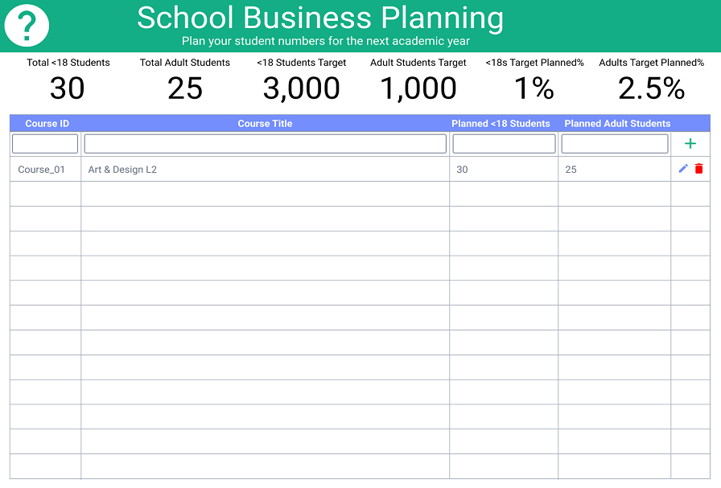

With this design, images were added to the ‘Start’ and ‘Enter Targets’ pages to enhance the visual appeal of the application. A ‘help’ button was also incorporated on all pages. During the development of the high-fidelity design, various colour schemes were experimented with before settling on the final colour palette used in the final design and application. 

In addition to solidifying the look and feel of the application, the design phase also highlighted several action points, which were added to the project backlog: 
* A ‘help’ icon linking to the README.md documentation would be a quick win for the project, as it would be simple to implement and valuable to users seeking guidance on the application. 
* Data validation should be implemented for user input fields to prevent errors, such as non-numeric values in numeric fields. 
* Data validation is also required for the percentage planned fields to prevent errors, such as divide-by-zero issues. 
* Ideally, the total cards should automatically update whenever a change is made to the business planning table. 

## Application Development 

The business planning system was developed using a combination of Hypertext Markup Language (HTML) and Cascading Style Sheets (CSS) for the user interface, and JavaScript (JS) for the functionality. Each webpage and its features were developed iteratively, with each feature linked to a corresponding GitHub issue and respective branch. The ‘Start’ page, index.html, was created first and this matched the high-fidelity design exactly. This page required only HTML and CSS, via styles.css, as its sole purpose is to link to the ‘Business Planning’ page. 

*Figure 7, index.html page of School Business Planning system*

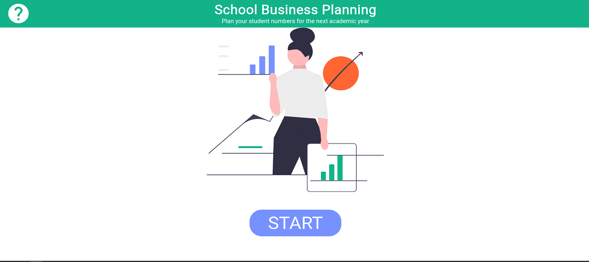 

Both the ‘Enter Targets’ and ‘Business Planning’ pages deviated from the original prototype designs. During development, it became evident that combining the functionality for entering targets and business planning numbers onto a single page would be simpler and more intuitive. Additionally, since student targets might be unknown initially or require amendment during business planning, having a separate page for entering targets was deemed unnecessary. 

To address this, the total targets cards on the business-planning.html page were changed into input boxes, allowing the users to enter or adjust target numbers whenever they need. As a result, the ‘Enter Targets’ page was removed as it was no longer necessary. 

An ‘Add Row’ button was implemented to appear just below the business planning table as it expands, rather than in the top row as originally designed. Additionally, the table rows were converted into input boxes, allowing its values to be edited directly without the need for a separate edit icon or button. These changes created more space for the content within the business planning table.  

After the interface for business-planning.html was created, a JavaScript file, business-planning.js, was developed to implement the required functionality. This included the neccessary features such as the ability to add, delete, and amend the row contents of the business planning table.  

*Figure 8, Example usage of business-planning.html page*

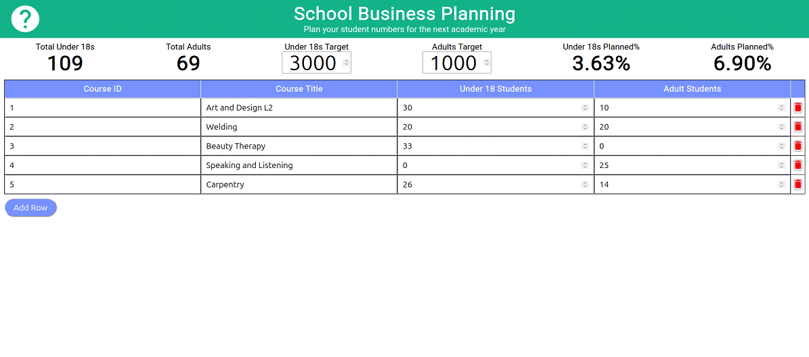 

Furthermore, the action points outlined in the design phase were implemented at this stage: 
* The help (?) button was added to both pages, linking to the README.md documentation of the system. 
* The updateTotals function is called whenever student numbers or targets are changed, automatically updating the values in the total cards. 
* Numeric input boxes were configured to prevent entry of numbers below 0. 
* Invalid values, such as divide-by-zero errors, result in ‘N/A’ for the ‘Planned%’ fields instead of causing a system error. 
* Invalid entries in the business planning table are excluded from total calculations instead of causing a system error. 

*Figure 9, Demonstration of features implemented from design phase action points*

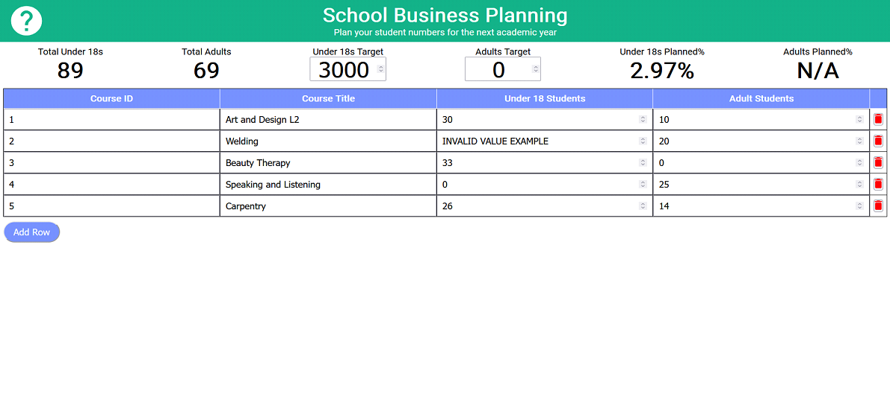 

Code comments were utilised throughout the development of the business application within the HTML, CSS, and JavaScript files. These code comments provide technical documentation, detailing the functionality and purpose of the project code, as exemplified in figure 10 below. 

*Figure 10, Example of code commenting via updateTotals function*

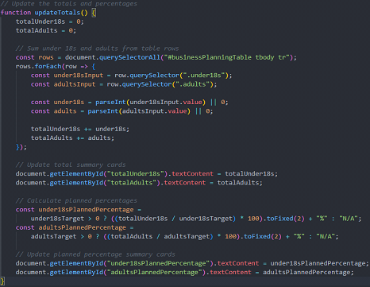 

Upon completion of the system's development, it was deployed to GitHub Pages, to generate an accessible link (figure 4). 

## Test-driven Development 

Test-driven development (TDD) was employed to test each function within business-planning.js to ensure that the functions are robust and behave as expected during execution. The Jest framework (OpenJS Foundation, 2024) was utilised for this white box testing (Maspupah, 2024), leading to the creation of business-planning.test.js. Multiple test cases were written to cover a wide range of scenarios within the business planning system, outputting the following results: 

*Figure 11, Unit test results of business-planning.test.js*

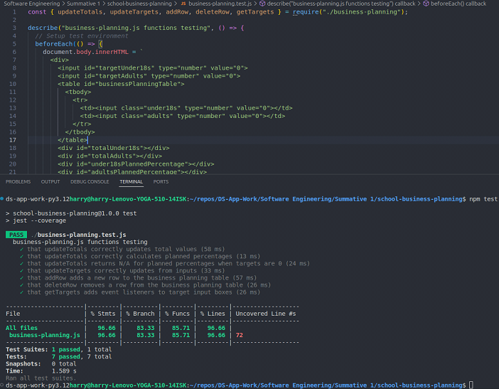
 
The results demonstrated that all unit tests passed successfully, achieving near-complete coverage of the statements, branches, functions, and lines in business-planning.js. Although efforts were made to include as many realistic cases as possible, certain parts of business-planning.js were purposefully excluded, resulting in slightly less than 100% coverage. For instance, the uncovered line 72, as shown above in figure 11, is simply a call to getTargets, which had already been tested earlier in business-planning.test.js. 

Black box testing (Maspupah, 2024) was also conducted to ensure the business planning system was fit for purpose from the users’ perspective. To perform this testing, a link to the mostly completed version of the application was shared with several users from various stakeholder groups involved in the project. The only context provided was that the application was an unfinished version of the business planning system. 

Since the interface of the system closely resembled the previously used business planning spreadsheets, user testers were able to quickly grasp the system’s functionality. As a result, the test feedback was very positive, with only minor changes requested, such as changing the label ‘<18 students’ to ‘under 18 students’ for better interpretability. 

## Project Evaluation and Future Development 

When gauging the project’s success based on meeting the aforementioned requirements, the output can be considered favourable. Results from the black box testing indicate that the system meets the requirement of being straightforward and intuitive to use. Business planning courses, numbers, and targets are accessible from a single page, fulfilling the requirement for a single platform. The ability to add, amend, and delete student numbers was successfully implemented, and the application effectively manages under-18 and adult student numbers separately. The application performs well on desktop computers (figure 8) and, though primarily designed for desktop use, is usable on other devices. 

*Figure 12, Business Planning system on Samsung Galaxy S20 Ultra*

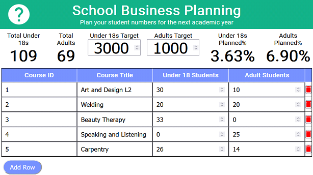

However, there are improvements and future features which could be incorporated into the School Business Planning system for future development sprints. For starters, after running a lighthouse report in Microsoft Edge, it was found that the application scores well for performance and web development best practices, but rather poorly in terms of accessibility. 

*Figure 13, Microsoft Edge Lighthouse report summary of Business Planning application*

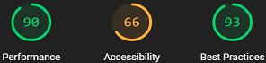

Upon further investigation, the poor accessibility score was primarily attributed to the lack of alternative labels for webpage elements, which is needed for users of assistive technologies, and an insufficient contrast ratio in the colour scheme, which poses difficulties for users with visual impairments such as colour blindness. Therefore, to resolve these issues and ensure compliance with the Web Content Accessibility Guidelines (Adams, et al., 2024), this can be added as a future action point to the project backlog. 

*Figure 14, Accessibility issues in Lighthouse report of Business Planning Application*

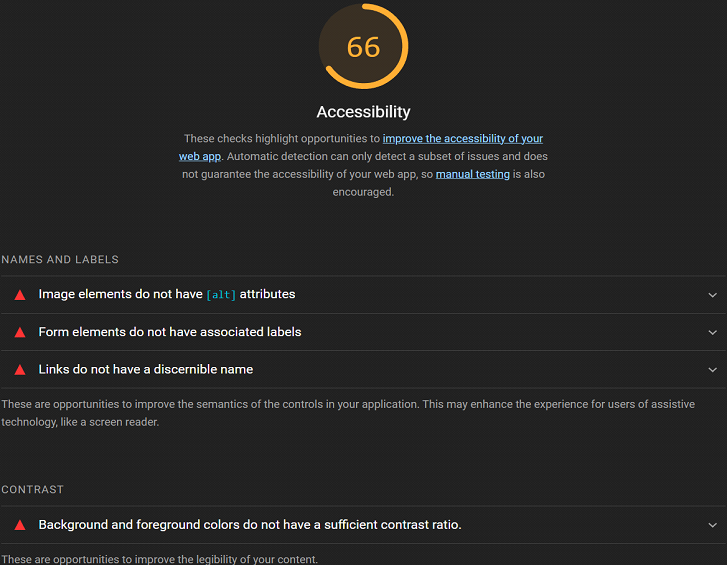

Although not part of the original requirements, a potential feature for future development could be the ability to save or export the results from the Business Planning System. The rationale behind this is that, if the application is to be used for business planning henceforth, saving the finalised numbers would be valuable for purposes such as comparing them to previous academic years’ data to inform student growth or decline. Possible options for this could include developing functionality to save the data to a file or export it to a database. This feature can be discussed with the project stakeholders and added to the project backlog. 

In summary, the School Business Planning application successfully met the original project requirements, although there are further improvements and enhancements which could still be developed for the system, which have since been added to the project backlog. 

*Figure 15, Future development backlog of School Business Planning project*

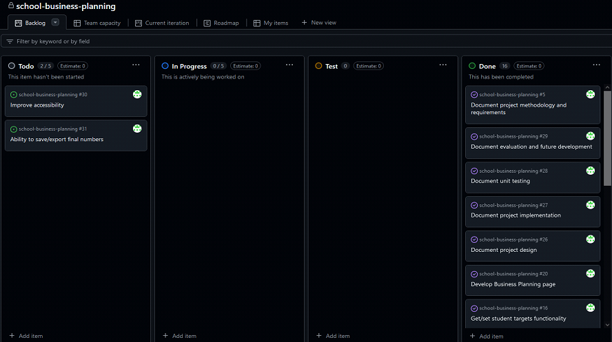

## References

Adams, C., et al (2024) *Web Content Accessibility Guidelines (WCAG) 2.2* [Online]. Available at: https://www.w3.org/TR/WCAG22/ (Accessed 27th December 2024) 

Bolton, P. and Lewis, J. (2023) *Further education funding in England* [Online]. Available at: https://commonslibrary.parliament.uk/research-briefings/cbp-9194/ (Accessed 19th December 2024) 

Layton, M. C. and Ostermiller, S. J. (2017) *Agile project management for dummies (Second edition)*, John Wiley & Sons Inc. [Online]. Available at: https://www.oreilly.com/library/view/agile-project-management/9781119405696/ (Accessed 19th December 2024) 

Maspupah, A. (2024) ‘Literature Review: Advantages And Disadvantages Of Black Box And White Box Testing Methods’, *Jurnal Techno Nusa Mandiri*, 21(2) [Online]. Available at: https://doi.org/10.33480/techno.v21i2.5776 (Accessed 27th December 2024) 

OpenJS Foundation (2024) *Jest* [Online]. Available at: https://jestjs.io/ (Accessed 24th December 2024) 

Pries, K. H. and Quigley, J. M. (2010) *Scrum project management (1st ed.)*, CRC Press [Online]. Available at: https://doi.org/10.1201/9781439825174 (Accessed 19th December 2024) 

Razzouk, R. and Shute, V. (2012). ‘What Is Design Thinking and Why Is It Important?’ *Review of Educational Research*, 82(3) [Online]. Available at: https://doi.org/10.3102/0034654312457429 (Accessed 19th December 2024) 